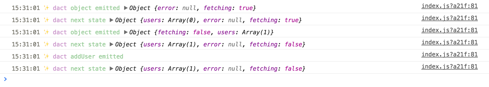

# dact-log [![Build Status][travis-image]][travis-url]

> Logger for [dact](https://github.com/andrepolischuk/dact)



## Install

```sh
npm install --save dact-log
```

## Usage

```js
import createData from 'dact'
import log from 'dact-log'

const initial = {
  users: []
}

const data = createData(initial, log)
```

## License

MIT

[travis-url]: https://travis-ci.org/andrepolischuk/dact-log
[travis-image]: https://travis-ci.org/andrepolischuk/dact-log.svg?branch=master
